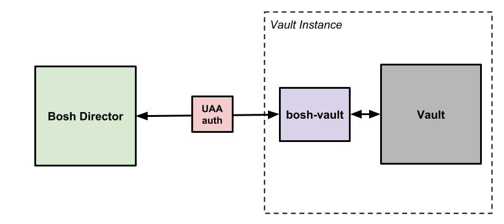

# Bosh Vault
This repo is an attempt to make an implementation of the config server API using Vault as a backend. It is a work in progress and should not be used.

[](https://circleci.com/gh/Zipcar/bosh-vault/tree/master)

# Current Progress
Currently the code is "feature complete" according to the [config server documentation](https://github.com/cloudfoundry/config-server/blob/master/docs/api.md) though there are additional pieces of metadata that could be added to make 
the returned data more like Credhub's implementation (creation time, etc). The following endpoints are working:

  - Get by id
  - Get by name
  - Put
  - Generate password
  - Generate certificate
  - Generate SSH Key
  - Generate RSA Key
  - Delete by name

There is not yet a Bosh release for this project but one will be created soon.

# Configuration
The bosh-vault binary can be configured in a couple of ways: a configuration file or the environment. A configuration file
can be passed using the flag: `-config` and passing a path to a JSON or YAML file of the form:

```
api_listen_addr: 0.0.0.0:1337 (Where the config server should bind to)
shutdown_timeout_seconds: 30 (How many seconds the config server should drain when shutting down)
log:
  level: ERROR 
vault:
  address: NO_DEFAULT
  token: NO_DEFAULT
  timeout: 30 (How many seconds we should wait when contacting Vault before timing out)
  prefix: secret (The name of the KV mount in Vault)
tls:
  cert: NO_DEFAULT (The cert used to secure the config server api)
  key: NO_DEFUAULT (The key used to secure the config server api)
uaa:
  enabled: true (Whether or not the config server should require and verify UAA JWT tokens)
  address: NO_DEFAULT (The address of the UAA server to communicate with)
  timeout: 10 (How many seconds to wait before timing out connections to UAA)
  ca: NO_DEFAULT (CA to trust when connecting to UAA)
  skipverify: false (Whether or not to skip verifying TLS trust)
  audienceclaim: config_server (Expected audience claim on a given JWT)
```

These variables can also be passed on the environment by prefixing them with `BV` and using underscores. For example to 
pass the uaa address: `BV_UAA_ADDRESS`

# Resources
  - [Config server api documentation](https://github.com/cloudfoundry/config-server/blob/master/docs/api.md)
  - [Credhub Implementation Docs](http://credhub-api.cfapps.io/version/2.1/)

# Architecture
The Vault Cloudfoundry Config Server is meant to be run alongside Vault and proxy config server requests.



## IDs and Names
The config server api requires all secrets to have a unique ID that points to a specific version of a given secret. Vault's [KV2 backend](https://www.vaultproject.io/docs/secrets/kv/kv-v2.html) implements versioned 
secrets already, however there is no "publicly" accessible concept of a UUID for a secret in Vault. Instead, secret versions
are requested at a given Vault path, for example: `vault kv get -version 3 secret/some_path/some_secret`. This is in contrast
to an implementation like Credhub for example which relies on a relational data store. 

There were a few ways to deal with this: 
  - Store multiple copies of the secret at different paths in Vault
  - Take liberties with the length and form of an id

The first option is obviously problematic for several reasons. The key ones being: difficulty managing access control rules (breaks the security model), and the
duplicated effort required to accomplish something (secret versioning) that Vault is already doing for us. We opted for the second option. As a result the ids 
generated by this config server implementation can get long. Our understanding is that these ids are only used by the bosh director anyway, in which case their
length is largely irrelevant. 

The other issue that arises without a relation data store is that any given "name" for a secret needs to also be a valid path in Vault. Spaces are a problematic
character since they're valid characters for a Bosh deployment name but invalid in a secret path. As a result our implementation
would need to in some way escape this and other potentially problematic characters.

We were able to solve both of these issues by making our id's base64 encoded metadata objects that contain no secrets:

```
{
  name: "/BLite Bosh Director/nginx/some_ssh_key",
  path: "secret/data/BLiteBoshDirector/nginx/some_ssh_key",
  version: 1
}
```

would encode to:

```
eyJuYW1lIjoiL0JMaXRlIEJvc2ggRGlyZWN0b3Ivbmdpbngvc29tZV9zc2hfa2V5IiwicGF0aCI6InNlY3JldC9kYXRhL0JMaXRlQm9zaERpcmVjdG9yL25naW54L3NvbWVfc3NoX2tleSIsInZlcnNpb24iOjF9
```

A long an incomprehensible id to be sure, but it is guaranteed to be:
  - unique and in a 1-to-1 relationship with a given path
  - secretless (paths in Vault or a secret store are not considered secret)
  - debuggable

# Contributing/Developer Workflow
This project is written in Go and the below workflow assumes you have a functional Go development environment setup. 
We do not yet use modules but will convert to them once they are more widely adopted. 

 1. Clone this repo into `$GOPATH/src/github.com/zipcar/bosh-vault`
 1. Run `make` to see the available workflow commands.
 1. Run `make test` to run tests locally.

## Testing with a preexisting Bosh director or no Bosh director
 1. Run `make build`
 1. Use the available configuration options to write a custom configuration file (JSON or YAML) and pass it to the built binary via the `-config` flag
 
## Testing with a local Bosh director
To simplify the developer workflow this project relies on a tool called `blite` that makes it easy to get a bosh-lite 
environment setup on your local machine. The makefile will download the latest `blite` script [from the Zipcar/blite repo](https://github.com/Zipcar/blite) 
but you are expected to already have the [prerequisites](https://github.com/Zipcar/blite#dependencies) installed. 

`blite` will give useful error messages if it notices one or more prerequisites are missing. The makefile specifies a 
few test deployment scripts that will ensure things are working as expected, but once the director is up you're able to 
do anything you'd otherwise be able to do with a bosh director. Resources used to configure the local binary and local
director are in the `local-dev` directory.

### Option 1: All-In-One Test Deploys
 1. Run `make bosh-lite` to setup a local bosh-lite director running UAA and configured to communicate with a local bosh-vault binary
 1. Run `make run` to start the config server
 1. Run `make test-deploy-nginx` to deploy NGINX that will serve a single page that is filled with plain text credentials to show they can all be generated. 
 
### Option 2: Just The Director
 1. Run `make bosh-lite` to setup a local bosh-lite director running UAA and configured to communicate with a local bosh-vault binary
 1. Run `make run` to start the config server
 1. Run `eval $(./bin/blite env-eval)` to seed your terminal's environment with the credentials of your local bosh director so you can use standard `bosh` commands
 
### Option 3: Blite/bosh-vault Power User
 1. Make sure the certs you want to use are in `local-dev/certs` (the next step will generate default certs if they don't exist)
 1. Run the compiled binary using your desired configuration (or the default in `local-dev/config`)
 1. Run `blite create` passing in operator and vars files using the `BLITE_OPS_FILE_GLOB` and `BLITE_VARS_FILE_GLOB` environment variables, at a minimum you'll need what is captured in `local-dev/operators` and `local-dev/vars`. Alternatively just add operator/vars files directly to those directories using the same naming convention.
 1. Run `eval $(./bin/blite env-eval)` to seed your terminal's environment with the credentials of your local bosh director so you can use standard `bosh` commands.
 1. Use bosh to set a custom cloud config (or use `blite cloud-config` for default settings)
 1. Use as a normal bosh director you power user you!
 
### Troubleshooting Dev Workflow Issues

#### Certificate Problems
Certificate problems are the most common cause of local dev frustration. Bosh requires config servers use TLS; to try
and make local development as simple as possible there is no port forwarding or DNS level magic happening on the bosh-lite
director. Instead the binary is bound on `0.0.0.0`, certs are generated for the hosts primary LAN IP (obtained using routes table),
and the director is configured to talk to the host machine over it's primary LAN IP. This works well until your IP changes;
say from a VPN connection, new wifi network, etc. For the moment the best way to deal with this issue is to run `make destroy`
and then start over with one of the local Bosh director options specified above. It should only take a few minutes to spin up 
a new director with fresh certs. 

For the brave, it is possible to manually fix cert mismatch problems by deleting in `local-dev/certs/local-dev.*`, running 
`make local-certs` to generate new ones, replacing `/var/vcap/jobs/director/config/config_server_ca.cert` and running 
`monit restart all` on the director then restarting bosh-vault with `make run` but it's probably a better idea to just 
destroy and recreate, it's fast and less error prone. Note that if you're reusing a shell session you may need to re-run
`eval $(./bin/blite env-eval)` to ensure your `bosh` command can communicate with the new director.

#### Networking Problems
`blite` provides networking helpers (like [`blite route-add`](https://github.com/Zipcar/blite#route-add)) that ensure your host machine can communicate with the things you deploy with a bosh-lite director.
Run `./bin/blite networking` to see what your current bosh-lite networking configuration is (default is bosh-lite default 
from the bosh-deployment repo). As mentioned in the [blite documentation](https://github.com/Zipcar/blite#avoiding-network-issues) your local network, VPN, etc
might conflict. If that's the case you can override the environment variables listed by the `networking` command and redeploy. 
If your networking issue is constant, say due to VPN routes conflicting, you should override those environment variables 
permanently in something like `~/.bashrc` or `~/.bash_profile` to ensure `blite` will always work properly.
